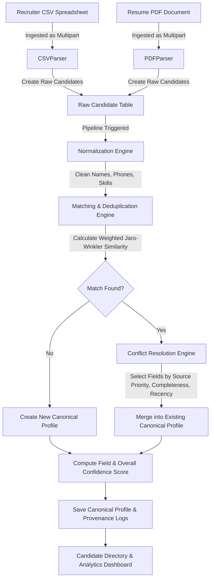
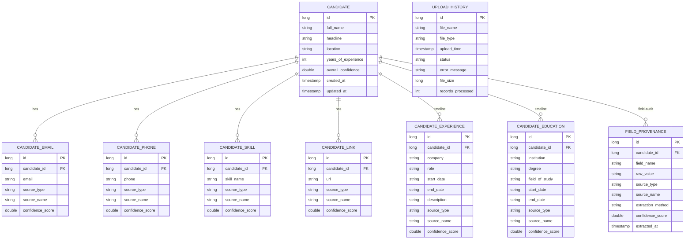

# Multi-Source Candidate Data Transformer

A comprehensive enterprise-grade solution that transforms messy recruiter candidate spreadsheets (CSV) and unstructured resume documents (PDF) into unified, canonical candidate profiles. The system features text normalization, high-accuracy deduplication via weighted Jaro-Winkler similarity, configurable source-priority conflict resolution, field-level provenance tracking, and scoring metrics.

---

## Architecture Overview

The system consists of a robust Spring Boot backend (Java 21) handling data extraction, schema mapping, and business logic pipelines, paired with a React (TypeScript + Tailwind CSS v4) dashboard for ingestion, pipeline controls, and profile inspection.



---

## Entity Relationship Diagram (ERD)

The relational schema is optimized to store unified canonical profiles while retaining full, field-level audit trails tracing back to original source uploads.



---

## Tech Stack

### Backend
*   **Java 25** / **Java 21**
*   **Spring Boot 3.3.1** (Spring Data JPA, Hibernate, Validation)
*   **PostgreSQL** (Active database) & **H2** (In-memory testing)
*   **Apache PDFBox 3.0.2** (Unstructured PDF text extraction)
*   **OpenCSV 5.9** (Recruiter data spreadsheet parser)
*   **MapStruct 1.5.5.Final** & **Lombok** (Boilerplate reduction)
*   **Springdoc-OpenAPI 2.5.0** (Interactive Swagger docs)
*   **JUnit 5 & Mockito** (Test suite)

### Frontend
*   **React 19**
*   **TypeScript**
*   **Vite 8**
*   **Tailwind CSS v4** (Utility-first CSS compiler plugin)
*   **Axios** (HTTP Request client)
*   **React Router DOM** (Single Page App routing)
*   **Lucide React** (Modern clean outline iconography)
*   **Recharts** (Dashboard reporting charts)

---

## Installation & Setup

### Prerequisites
*   Java Development Kit (JDK) 21 or newer
*   Node.js (v20 or newer) & npm (v10 or newer)
*   PostgreSQL Service installed and active

### 1. Database Configuration
1.  Connect to your PostgreSQL shell/service:
    ```bash
    psql -U postgres
    ```
2.  Create the database for the candidate transformer:
    ```sql
    CREATE DATABASE candidate_db;
    ```
3.  Configure database credentials in the application configuration at:
    `src/main/resources/application.properties`
    ```properties
    spring.datasource.url=jdbc:postgresql://localhost:5432/candidate_db
    spring.datasource.username=postgres
    spring.datasource.password=YOUR_PG_PASSWORD
    ```

### 2. Running the Backend
1.  Clean, compile, and run the test suite to verify H2 tests:
    ```bash
    mvn clean test
    ```
2.  Start the Spring Boot web application:
    ```bash
    mvn spring-boot:run
    ```
    The server will startup on port `8081`.
3.  View the Swagger REST API documentation at:
    `http://localhost:8081/api/swagger-ui/index.html`

### 3. Running the Frontend Dashboard
1.  Navigate into the frontend project directory:
    ```bash
    cd frontend
    ```
2.  Install dependencies:
    ```bash
    npm install
    ```
3.  Start the local development server:
    ```bash
    npm run dev
    ```
    The client interface will open at: `http://localhost:5173/`

---

## Pipeline Execution Features

### Normalization
*   **Names**: Clears leading/trailing double whitespaces and formats names to Title Case.
*   **Phones**: Formats phone patterns into standard `+E.164` notation (e.g. `+11234567890`).
*   **Skills**: Looks up raw skill tokens (e.g., `reactjs`, `springboot`) in an alias dictionary map, standardizing them into official canonical values (`React`, `Spring Boot`).

### Matching & Deduplication
*   Matches raw records against existing profiles by performing:
    *   Exact email comparisons.
    *   Exact phone number matches.
    *   Weighted Jaro-Winkler string distance scoring on Full Names (threshold defaults to `0.85` or greater).

### Conflict Resolution & Provenance
*   Resolves value conflicts by checking **Source Priority** configuration properties:
    *   PDF resumes (priority `2` - higher) automatically overwrite values imported from CSV sheets (priority `1` - lower).
*   **Provenance Retention**: Every single value (name, location, years of experience, skill tags, timeline employment) retains reference details tracing it back to the exact source filename, extraction method, date, and field-level parser confidence score.

### Dynamic Schema Projection (Configurable Output)
*   Provides a runtime transformation layer that reshapes canonical candidate profiles into custom schemas without database migrations or code changes.
*   Accepts a runtime configuration JSON specifying destination paths, source mappings (`from`), custom overrides/normalizations, missing value behaviors (`null`, `omit`, or `error`), and flags to toggle metadata (confidence and provenance).

---

## API Endpoints

### Data Ingest
*   `POST /api/upload/csv` - Ingest recruiter candidate CSV spreadsheets.
*   `POST /api/upload/resume` - Ingest individual resume PDF files.

### Transformation Control
*   `POST /api/transform` - Execute the match and deduplication merge pipelines on all imported raw records.

### Candidate Profiles
*   `GET /api/candidates` - Search, filter, page, and sort unified canonical profiles.
*   `GET /api/candidate/{id}` - Fetch details for a specific canonical profile, including timelines and field-level provenances.
*   `POST /api/candidate/{id}/project` - Dynamically reshape, map, and normalize a specific candidate profile using a JSON configuration.
*   `POST /api/candidates/project` - Batch project multiple candidate profiles using a JSON configuration.
*   `DELETE /api/candidate/{id}` - Delete a candidate profile.
*   `GET /api/candidates/locations` - Fetch list of unique candidate locations.
*   `GET /api/candidates/skills` - Fetch list of unique candidate skills.
*   `GET /api/candidates/dashboard-stats` - Fetch aggregate counts and confidence stats.

### Audit Log
*   `GET /api/history` - Fetch file upload metadata history and parser exception logs.
